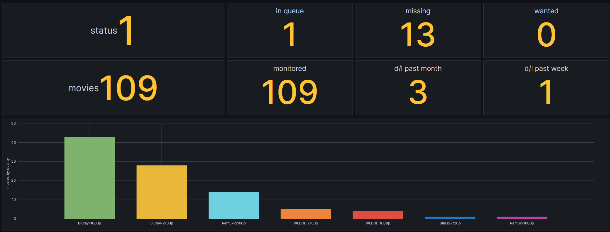

# exportarr

AIO Prometheus Exporter for Sonarr, Radarr, Lidarr, Prowlarr, Readarr, and Sabnzbd

[](https://goreportcard.com/report/github.com/onedr0p/exportarr)

Note: This exporter will not gather metrics from all apps at once, and instead you an `exportarr` instance for each app. Be sure to see the examples below for more information.



## Usage

### Docker Compose

See examples in the [examples/compose](./examples/compose/) directory.

### Kubernetes

See examples in the [examples/kubernetes](./examples/kubernetes/) directory.

### Docker CLI

_Replace `$app`, `$port` and `$apikey` with one of the support apps, port and api key_

```sh
# PORT must be unique across all exportarr instances
docker run --name exportarr_$app \
  -e PORT=9707 \
  -e URL="http://x.x.x.x:$port" \
  -e APIKEY="$apikey" \
  --restart unless-stopped \
  -p 9707:9707 \
  -d ghcr.io/onedr0p/exportarr:latest $app
```

Visit http://127.0.0.1:9707/metrics to see the app metrics

### CLI

_Replace `$app`, `$port` and `$apikey` with one of the support apps, port and api key_

```sh
./exportarr $app --help

# --port must be unique across all exportarr instances
./exportarr $app \
  --port 9707 \
  --url "http://x.x.x.x:$port" \
  --api-key "$apikey"
```

Visit http://127.0.0.1:9707/metrics to see the app metrics

## Configuration

| Environment Variable         | CLI Flag                       | Description                                                    | Default   | Required |
|:----------------------------:|--------------------------------|----------------------------------------------------------------|-----------|:--------:|
| `PORT`                       | `--port` or `-p`               | The port exportarr will listen on                              |           | ✅       |
| `URL`                        | `--url` or `-u`                | The full URL to Sonarr, Radarr, or Lidarr                      |           | ✅       |
| `API_KEY`                     | `--api-key` or `-a`            | API Key for Sonarr, Radarr or Lidarr                           |           | ❌       |
| `API_KEY_FILE`                | `--api-key-file`               | API Key file location for Sonarr, Radarr or Lidarr             |           | ❌       |
| `CONFIG`                     | `--config` or `-c`             | Path to Sonarr, Radarr or Lidarr's `config.xml` (advanced)     |           | ❌       |
| `INTERFACE`                  | `--interface` or `-i`          | The interface IP exportarr will listen on                      | `0.0.0.0` | ❌       |
| `LOG_LEVEL`                  | `--log-level` or `-l`          | Set the default Log Level                                      | `INFO`    | ❌       |
| `DISABLE_SSL_VERIFY`         | `--disable-ssl-verify`         | Set to `true` to disable SSL verification                      | `false`   | ❌       |
| `AUTH_PASSWORD`        | `--auth-password`        | Set to your basic or form auth password                                |           | ❌       |
| `AUTH_USERNAME`        | `--auth-username`        | Set to your basic or form auth username                                |           | ❌       |
| `FORM_AUTH`            | `--form-auth`            | Use Form Auth instead of basic auth                                        | `false` | ❌       |
| `ENABLE_ADDITIONAL_METRICS`  | `--enable-additional-metrics`  | Set to `true` to enable gathering of additional metrics (slow) | `false`   | ❌       |
| `ENABLE_UNKNOWN_QUEUE_ITEMS` | `--enable-unknown-queue-items` | Set to `true` to enable gathering unknown queue items          | `false`   | ❌       |
| `PROWLARR__BACKFILL`         | `--backfill`                   | Set to `true` to enable backfill of historical metrics         | `false`   | ❌                |
| `PROWLARR__BACKFILL_SINCE_DATE` | `--backfill-since-date`      | Set a date from which to start the backfill                    | `1970-01-01` (epoch) | ❌                |

### Prowlarr Backfill

The prowlarr collector is a little different than other collectors as it's hitting an actual "stats" endpoint, collecting counters of events that happened in a small time window, rather than getting all-time statistics like the other collectors. This means that by default, when you start the prowlarr collector, collected stats will start from that moment (all counters will start from zero).

To backill all Prowlarr Data, either use `PROWLARR__BACKFILL` or `--backfill`.

Note that the first request can be extremely slow, depending on how long your prowlarr instance has been running. You can also specify a start date to limit the backfill if the backfill is timing out:

`PROWLARR__BACKFILL_DATE_SINCE=2023-03-01` or `--backfill-date-since=2023-03-01`
